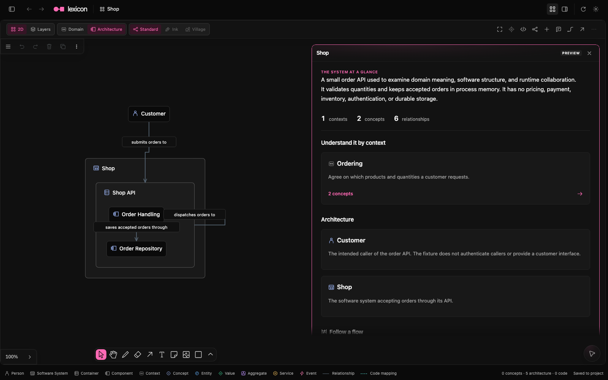

# Lexicon

Understand your codebase through the ideas it implements.

Lexicon connects domain meaning, software architecture, and code in one shared model. Start with a question, explore the concepts and their relationships, then open the implementation behind them. Refine the model as your team learns.



*The Shop example, with its architecture on the canvas and the project explanation alongside it.*

[Get started](#get-started) · [Model a project](#model-a-project) · [Agent setup](#use-with-an-agent) · [Manifesto](MANIFESTO.md) · [Model reference](MODEL.md)

## Explore a system

Browse concepts by context, follow relationships, and inspect the source behind each explanation. Search finds model names and source locators; source links open the relevant code or document. You can share an address to return to the same item and source link.

The canvas holds the model alongside notes, drawings, and media. Switch between Diagram and Atlas, focus on a neighborhood, or follow cross-dimension radials to another plane. Linked Sources projects authored source links as shared file and target nodes; these stay off the individual Domain and Architecture planes. Combined brings Domain, Architecture, and Linked Sources into one 2D canvas. The experimental Files / File Map view is available through Project settings → Development options; its standalone LOC-weighted map returns to the previous canvas. Planes places Domain, Architecture, and Linked Sources on separate planes so you can follow their connections. Canvas layout stays separate from model meaning.

Domain concepts draw on DDD, software structure uses C4, and flows show the order of interactions in a scenario. The [viewer guide](viewer/README.md#canvas) covers navigation and saved layouts; [Planes](PLANES.md) describes that view's current limits.

## Get started

### macOS app

Build or install the app with the [desktop guide](viewer/desktop/README.md). It bundles the local server and links to newer releases when available.

### Run locally

```sh
cd viewer
bun install --frozen-lockfile
bun run build:client
bun start
```

Open http://127.0.0.1:5374 and try Shop from the library. It's a self-contained example with domain, C4, and sequence views; its files live in `examples/`.

For development, run `mise run viewer` from this repository and open http://127.0.0.1:5373.

Refresh reloads the current files. Only schema 3.3 is parsed. If a project uses an older schema, Agent stays available so you can request a [migration](MIGRATION.md).

## Model a project

```text
project/
  lexicon/
    model.xml       # domain, software structure, relationships, flows, source links
    docs/           # project prose; organize it as needed
```

Start with one useful question about your codebase and [a minimal model](MODEL.md#minimal-example). Use the names people use when discussing the domain, and explain how those names map to implementation symbols in the source links.

You can also add a project folder without a model and open Agent. Ask about the implementation, then request model changes when you're ready. Codex, Grok, and Claude use your local login. Changes are validated and can be undone. See the [conversation guide](viewer/README.md#chat) for details.

Check the structure and linked source:

```sh
cd viewer
bun run check /absolute/path/to/project
```

If the model lives outside the code checkout, add `--code-root /path/to/code`. The checker reports model errors, broken links, and unsupported symbol lookups separately. It resolves Python and TypeScript/TSX declarations; other file types can use file or line links.

## Use with an agent

### Shared local skill

From this checkout, link the skill into the shared agent directory:

```sh
mkdir -p ~/.agents/skills
ln -s "$PWD/skills/lexicon" ~/.agents/skills/lexicon
cd viewer
bun install --frozen-lockfile
```

The skill and launcher use this checkout directly, including uncommitted edits. Keep it at the linked location. Inspect any existing destination before replacing it.

The launcher works from any working directory:

```sh
bun ~/.agents/skills/lexicon/scripts/lexicon.ts root
bun ~/.agents/skills/lexicon/scripts/lexicon.ts check /path/to/project
```

Agents that scan `~/.agents/skills/` can load the skill. After editing its instructions, ask your agent to reread `~/.agents/skills/lexicon/SKILL.md`. Start a fresh session if it still uses old instructions or cannot find the skill. The checker reads its source on every command; reinstall dependencies only when they change.

### Claude Code

Point Claude Code at the same skill, after inspecting any existing destination:

```sh
mkdir -p ~/.claude/skills
ln -s ~/.agents/skills/lexicon ~/.claude/skills/lexicon
```

This makes `/lexicon` available. If you still have an old `laxicon` adapter pointing to `skills/laxicon/`, move it outside the discovery directory.

Or install the repository as a Claude Code plugin:

```text
/plugin install github:huylenq/lexicon
```

Keep the full repository installed and run `bun install --frozen-lockfile` in its `viewer/` directory so the skill’s checker has its dependencies.

The plugin exposes `/lexicon:lexicon` to read, create, or update a model. The [skill](skills/lexicon/SKILL.md) starts from the system's concepts and traces how they work together. It reviews coverage and source accuracy separately. Embedded chat uses the same workflow files and builds on the model you already have.

### MCP clients

Compatible local MCP clients can inspect the model and navigate the live viewer. See [available capabilities](AGENT-CAPABILITIES.md) and [integration setup](viewer/AGENT-INTEGRATION.md).

## Development

```sh
cd viewer
bun run test
bun run typecheck
bun run build:client
```

The runtime contract lives in `viewer/shared/model.ts`; the XML parser and structural checks live in `viewer/server/model.ts`. The client consumes the same types. The server binds to loopback. Declared model links and Files browsing have separate source endpoints; both keep reads within the selected checkout.

The [pre-lean implementation](quarantine/pre-lean-b089f1c/README.md) is preserved as browsable source for future distillation.

MIT licensed. Earlier design history remains in [CHANGELOG.md](CHANGELOG.md) and Git.

### Document source links

The Source Reader reads implementation code and supporting Markdown documents. Markdown supports rendered and raw views, a heading navigator, and stable owner-local mapping IDs. Existing `<code-link>` XML remains supported; use `heading="section-anchor"` and `role="specification"` to link a documented requirement. See [Source links](MODEL.md#source-links) and the [document source example](examples/document-sources/README.md). Document evidence establishes what is specified, not what is implemented or enforced.

Source links have an explicit `kind`: `code` for implementation source and symbol lookup, or `document` for written evidence and document navigation. Kind, locator, role, and evidence qualification stay separate; see [Source-link taxonomy](MODEL.md#taxonomy). Schema 3.3 models require migration from earlier versions.
