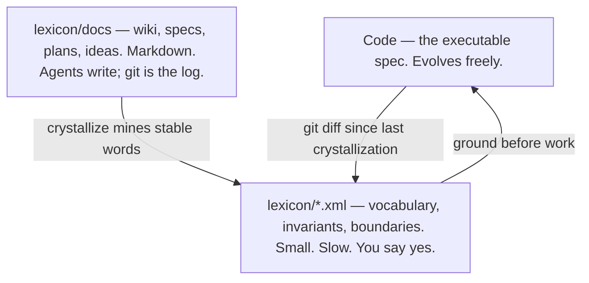
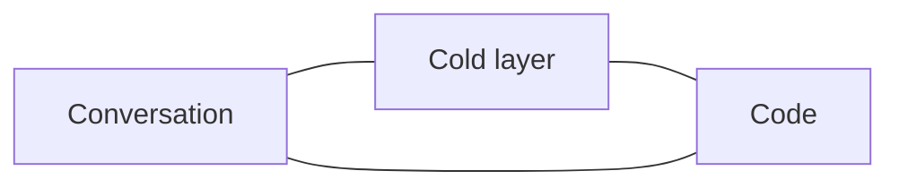
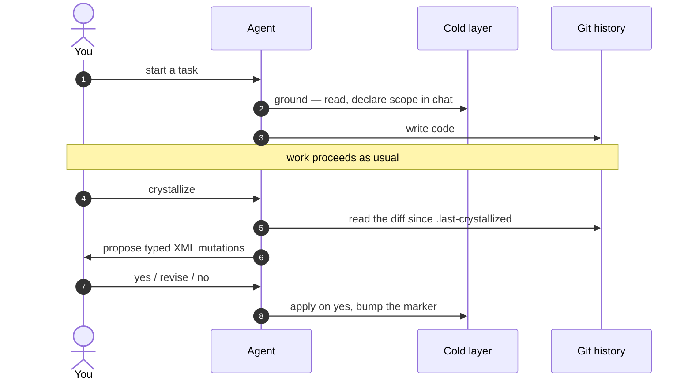
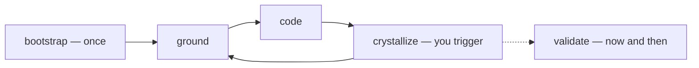

# lexicon

<p align="center">
  
</p>
<p align="center"><em>The cold layer is the small map. Code is the city.</em></p>

Working with a coding agent, the same three things keep going wrong:

1. **Vocabulary drifts.** "Case" becomes "Record" becomes "Entry" across three turns, and nobody notices until something breaks.
2. **Boundaries leak.** The agent fixes a bug in module A by reaching into module B, violating a rule that was never written down.
3. **Decisions vanish.** By turn 40, neither of you can find the choice made on turn 12.

Lexicon's bet: **a small living document captures the invariant parts of the system** — the words, the rules, the why — and a workflow makes both human and agent read it before work, then update it deliberately when something is learned.

Code is the executable spec. It evolves freely. Above it, a **cold layer** of typed XML (`lexicon/system.xml`) holds what code expresses badly: vocabulary, invariants, bounded contexts. Markdown under `lexicon/docs/` holds the rest of the prose. The cold layer evolves at the speed of *learning*, not the speed of typing.

This is not spec-driven development. Alignment is a small document both of you keep true.

Built on Eric Evans' [Domain-Driven Design](https://en.wikipedia.org/wiki/Domain-driven_design): ubiquitous language inside bounded contexts, term categories (entity / value / service / event / concept), aggregates, shared kernels, typed context-map seams, subdomains. If the project has a UI, design vocabulary — tokens, components, named surfaces and regions, a11y contracts — lives in the same cold doc.

## Three temperatures



| Layer | What it is | Who writes | When it changes |
|---|---|---|---|
| **Cold** `system.xml`, `contexts/`, `surfaces/` | Typed graph of words and rules | Agent proposes, you approve | When you run `crystallize` |
| **Docs** `lexicon/docs/` | Wiki, specs, plans, ideas | Agent or you, under the current task | Whenever the work needs it |
| **Code** | What actually runs | Agent or you | Freely |

There is one human gate: **cold-layer XML**. Markdown is not a second government. Distillation is one-way: prose and git history into XML, only through `crystallize`.

## Same words, three places

The load-bearing idea is **ubiquitous language**. The same nouns have to appear in conversation, in the cold layer, and in code. When they don't, drift has somewhere to hide.



If the agent starts saying "Tile" for something the glossary calls `Card`, that is a crystallize signal — not a clever rename.

## The loop



- **`ground`** happens at the start of non-trivial work. Read the cold layer, say out loud which context and terms are in play. No file writes.
- **Code** happens as it always does.
- **`crystallize`** happens when *you* say the work landed. The agent is a bad judge of "done." It reads the git diff since `lexicon/.last-crystallized`, proposes mutations, and waits.

Git history is the session log. There is no separate retro step.

Occasionally, **`validate`** looks backward: is the schema current, and does the cold layer still match the code? **`spec`** is just "write a markdown design doc under `lexicon/docs/specs/`," linking cold-layer atoms with `[[fqid]]` instead of inventing a second glossary.



## In a project

```
lexicon/
  system.xml               # cold layer root
  contexts/<slug>.xml      # one file per bounded context
  surfaces/<slug>.xml      # UI surfaces and regions, if any
  docs/
    wiki/                  # explanation a human can read
    specs/                 # design / architecture
    plans/                 # disposable execution notes
    ideas/                 # pre-commitment thinking
  .last-crystallized       # crystallize reads the git diff newer than this
  bootstrap.md             # one-shot setup report
  validate.md              # drift report
```

The workflow is opt-in. Small scripts and throwaway prototypes usually don't want it. Decline the bootstrap prompt, or drop a `.lexicon-skip` file at the repo root.

## Moves

A Claude Code plugin with three skills: `using-lexicon` (awareness — parks the disposition, offers the right move, never gates), `lexicon` (the verbs), and `laxicon` (thin contract: prose lives at `lexicon/docs/`).

| Command | When | What |
|---|---|---|
| `/lexicon:bootstrap` | Once, at setup | Drafts `system.xml` from existing docs and code, then interviews you one decision per turn |
| `/lexicon:ground` | Before substantive work | Reads the cold layer, declares scope in conversation. No writes |
| `/lexicon:crystallize` | **You** say so | Reads the git diff since the last marker, proposes XML mutations, applies on yes |
| `/lexicon:spec` | Writing a design doc | Markdown under `lexicon/docs/specs/`. Vocabulary stays in the cold layer via `[[fqid]]` |
| `/lexicon:validate` | Periodically, or on a schema bump | Structural migration + semantic triage against current code |
| `/lexicon:meta-evolve` | After you correct the skill itself | Amends this bundle. Slash-only; writes to `~/src/lexicon/` |

Cold-layer edits go through `crystallize`: propose in chat, agree, apply. No proposal files, no merge queue.

A local **viewer** renders the cold layer as a reading room and a graph, with specs linked in. It does not write.

## Install

```bash
# As a Claude Code plugin
/plugin install github:huylenq/lexicon
```

Local development:

```bash
git clone https://github.com/huylenq/lexicon
claude --plugin-dir ./lexicon
```

The six verbs are namespaced `/lexicon:<command>`. `using-lexicon` auto-fires in a project that already has `lexicon/system.xml`.

## First use

On the first substantive task in a project without `lexicon/system.xml`, the skill will offer `bootstrap`. Accept it (or say "set up lexicon") and you get a first-cut cold layer plus a one-decision-per-turn interview to resolve gaps. Pause at any item boundary; the triage report at `lexicon/bootstrap.md` records what was resolved vs deferred.

## What this is not

- **Not a planning tool.** Native plan mode still exists. `lexicon/docs/plans/` is just where a plan file can live.
- **Not a code-review tool.** It runs before code, not after.
- **Not a documentation generator.** The doc lives in the repo and is kept by you and the agent together.
- **Not a substitute for knowing the domain.** It can help you discover invariants. It cannot invent them.

## Status

Early. Cold-layer schema is v1.0 XML. The per-session retro step was removed: `crystallize` reads the git diff directly. The shape is in use on real projects; it is still being simplified. Issues and PRs welcome.

Design rationale and rejected alternatives: [`CLAUDE.md`](./CLAUDE.md). Version history: [`CHANGELOG.md`](./CHANGELOG.md).

## License

MIT
