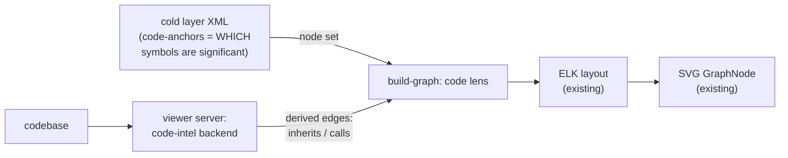
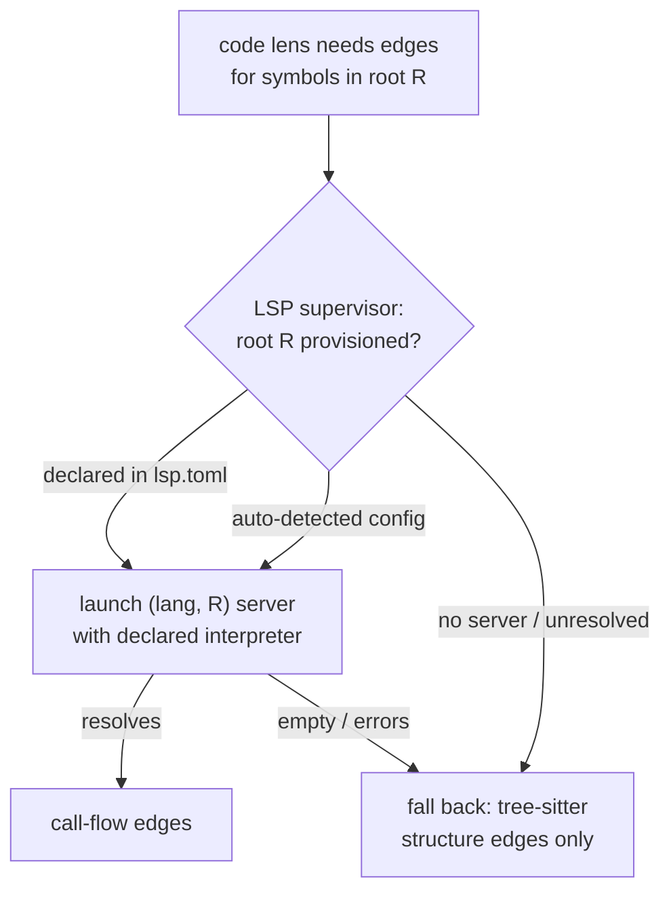

# Code lens — a domain-selective class/call diagram over the cold layer

Add a third graph lens that renders the codebase's significant classes and their structural and call relations, where "significant" is filtered by the cold layer's existing code anchors. Two relation tiers: a structural (UML-shaped) tier derived by tree-sitter, and a call-flow (sequence-shaped) tier derived by a viewer-managed LSP supervisor.

## Motivation

The cold layer already pins *which* code symbols carry domain weight — every `<term>` may carry `<symbols><code-anchor file= line= symbol=/></symbols>`, every `<invariant>` a `<constrains-code>` (`viewer/server/schema.ts`, `CodeAnchor` on `ResolvedEntity.symbols` / `.constrainsCode`). But that anchor data dead-ends in the detail pane (`client/src/components/CodeAnchorBadge.tsx`, `PeekDrawer.tsx`) — it never reaches the graph. The two existing lenses (`ownership`, `surfaces` in `client/src/lib/graph/build-graph.ts`) draw only *declared* edges between atoms (`disambiguates`, `seam`, `narrative`). So the viewer can tell you what a `Customer` *means* but not how the `Customer` class relates to the others structurally, or who calls into it.

An IDE renders inheritance and call hierarchy already — but as an exhaustive tree over *every* class, with no notion of which classes are domain-significant. The artifact no IDE can produce is the **domain-selective** one: the inheritance graph or the caller/callee flow restricted to the handful of classes the cold layer marks as load-bearing, with the irrelevant 95% collapsed. That selectivity is the entire pitch. It is also the discipline: the moment the lens shows every class and every edge, it has become a worse IDE embedded in the viewer, and it betrays the same anti-exhaustiveness rule lexicon enforces everywhere else.

## Decision 1 — The code lens is additive over the existing ELK/SVG graph, not a new rendering stack

The graph subsystem is already lens-pluggable and the substrate is strong: `build-graph.ts` produces a generic node/edge model per named lens; `layout.ts` lays it out with ELK (`elkjs ^0.11.1`) using the `layered` (Sugiyama) algorithm; `GraphNode.tsx` renders plain SVG; `manual-layout.ts` + `manual-layout-store.ts` persist hand-arrangement per-project-per-lens in `localStorage`. Adding a lens is: a new entry in `LENSES`, a `buildCodeModel()` builder, new `EdgeKind` values (`inherits` | `implements` | `calls`), and lens-specific ELK options. No schema change, no loader change, no new rendering library.

ELK `layered` is *already* the canonical layout for both inheritance DAGs and call graphs, so neither relation tier needs new layout tech — only different direction/spacing options in `lensOpts()`.

**Rejected — mermaid for the interactive lens.** `mermaid ^11.15.0` is a dependency, but it renders *static* diagrams. Routing the interactive code view through it would discard everything the existing canvas already gives for free: shared node identity, the peek-into-code drawer, persisted manual layout, and per-kind SVG node rendering. Mermaid keeps a role (Decision 5), just not here.

**Rejected — reactflow / cytoscape rewrite.** The current plain-SVG + ELK stack is sufficient and already invested-in (orthogonal routing, HEB/A* edge-bundling tactics in `layout.ts`). Swapping engines buys nothing the new lens needs.

## Decision 2 — Nodes are stored; edges are derived. Never store structural or call relations in the cold layer.

The node set comes from the cold layer: an entity earns a node in the code lens when it carries a resolvable `<code-anchor symbol=>`. That set *is* the domain-selective filter — it is small, human-curated, and evolves at the speed of learning, which is exactly what the cold layer is for.

The edges — inheritance, implementation, association, calls — are **derived live from the codebase by the viewer server**, never written into `system.xml` / `contexts/*.xml`. Storing them would recreate the drift lexicon exists to kill: inheritance parents and call sites churn every commit, and a hand-transcribed class diagram is stale the moment it lands. This also fixes a latent weakness in the current anchor design — `line-start`/`line-end` are stored and *rot* (`reference/schema.md` already warns to re-resolve every `file=` before finishing). Under this design, `symbol=` is the durable identity and line numbers become a cache the code-intel backend repopulates.

The split is the load-bearing invariant: **cold layer owns the node set; the backend owns the edges.** If a future iteration is tempted to add a `<relation>` or `<extends>` element to the schema, stop — that is the code-mirror this decision exists to forbid.

## Decision 3 — Two edge tiers split along syntactic vs. semantic: tree-sitter structure (always-on) and LSP call-flow (best-effort)

The user's UML-vs-sequence intuition maps exactly onto tool capability:

| Tier | Relations | Source | Availability |
|---|---|---|---|
| **Structure** (UML) | `inherits`, `implements`, members, association by field type | **tree-sitter** | high — pure syntax, no server, no env; any grammar |
| **Call-flow** (sequence) | `calls` (caller↔callee across files) | **LSP** `prepareCallHierarchy` + `incomingCalls`/`outgoingCalls` | lower — needs a correctly-provisioned server per root |

Structure is syntactic — tree-sitter resolves class declarations, `extends`/`implements`, and member lists with no interpreter and no `node_modules`. Call-flow is semantic — resolving a call expression to the definition it targets, across files, genuinely requires name resolution (LSP, or a static index like SCIP). tree-sitter can *find* a call site but cannot *resolve* its target, so it cannot build a call graph.

Consequence: **structure ships first and is the always-works baseline; call-flow is the richer, fragile, env-gated tier.** This ordering is not a convenience — it is forced by what each tool can do without a provisioned environment (see Decision 7).

> **Validated 2026-06-17 (tree-sitter spike).** Ran a throwaway tree-sitter extractor against both stacks. **TypeScript (viewer):** zero classes — the structural vocabulary is *interfaces + type aliases*, so the structure tier is **type-declaration-centric, not class-centric**; three edge kinds fell out (`extends`, `implements`, `uses`), and `uses` (composition) dominated inheritance **56:2**, making per-edge-kind filtering essential rather than optional. **Python (`honeywell` backend libs):** 205 classes, 122 resolved edges, real multi-level hierarchies surfaced (`HoneywellForgeResource → CachedBMSResource → BaseResource`; an agent family under `ForgeSTARAgent`). Selectivity (restrict to a significant set + 1-hop) collapsed 48→19 nodes (TS) and 205→7 nodes (Python) — the cold-layer-filter behavior D2 predicts, on real code. Tree-sitter ran with no env, no `node_modules`, no interpreter. Two ceilings confirmed: (1) edge resolution is **name-matching within the parsed set**, which can't disambiguate same-named types across modules (the syntactic→semantic boundary — LSP's job); (2) the node binding throws `Invalid argument` on files >~32KB (12 of ~400 Python files, ~3%) — a fixable buffer/callback config issue, not a grammar gap. P1 must configure the large-file path.

> **Built & validated 2026-06-17 (P1, integrated).** Structure backend shipped end-to-end on the viewer: `server/code-intel.ts::extractStructureEdges` → loader (`graph.codeEdges`) → `buildCode` render. `tree-sitter` native loads under **bun** (the viewer's runtime) once pinned to `0.21.1` — `0.25.0` ships a broken prebuild path. On the viewer's own cold layer it derived **5 `uses` edges** (the lexicon-loading composition chain), laid out with **0 dangling**; 21/21 graph tests pass. New finding — **symbol collisions fan out**: when two atoms anchor the same `symbol=` (the `fqid` kernel term and the `EntityRef` term both anchor `EntityRef`), a reference emits an edge to *both*. That is correct behavior, and it makes the structure tier a **cold-layer linter**: one code symbol claimed by two atoms is a modeling smell worth a `validate` check. The name-match ceiling (1) is the same mechanism — both are resolved by P2's LSP `goToDefinition`/`workspaceSymbol`.

## Decision 4 — Representation split: interactive node-link on the existing canvas; generated mermaid for time-ordered sequences

Node-link relations — inheritance graphs, and "who calls whom among the significant classes" — render on the existing ELK/SVG canvas as toggleable edge kinds within the code lens. This is the interactive exploration surface.

A true **sequence diagram** (lifelines, time-ordered messages for one specific path) is a different rendering that the node-link canvas does not do well. That is mermaid's job — and mermaid already renders inside specs (`client/src/components/` mermaid rendering, used by the `spec` subcommand). So a time-ordered flow is **generated** as a mermaid `sequenceDiagram` block emitted *into a spec*, from the same LSP call-hierarchy data that feeds the call-flow lens. Interactive graph → canvas; narrative-embedded trace → mermaid in a spec. Both renderers already exist; neither is new work beyond generation.

## Decision 5 — Cross-lens linking is free via shared fqid node identity

A code-lens node is the *same* entity node (same fqid, same `GraphNode` component) as in the `ownership` lens. So "the concept lens and the code lens are linked" requires no bridging logic: clicking a class in the code lens *is* selecting the same atom as in the concept graph, and the existing peek drawer already opens its source. The lenses are different edge layers over an overlapping node set, not two disconnected diagrams.

Realization choice: a third entry in `LENSES` (matching the existing per-lens `buildModel` architecture) is simpler than a combined lens with per-layer edge toggles, and is the recommended path. Edge-kind visibility toggles *within* the code lens cover the UML-vs-call distinction.

## Decision 6 — The code-intel backend lives in the viewer server, not the harness LSP

The viewer is a running app and controls its own process lifecycle; it must own its code intelligence. It must **not** depend on the agent's harness LSP tool — which is not guaranteed present even for TypeScript (verified: `documentSymbol` on `viewer/server/loader.ts` returned "No LSP server available for file type: .ts" in-session). Two consumers, two providers: the viewer server runs tree-sitter and manages LSP servers for rendering; the agent (`ground`/`validate`) uses harness LSP best-effort with a fallback (Decision 8).

## Decision 7 — LSP provisioning is a per-root supervisor: detected-or-declared, lazy, exclusion-aware, gracefully degrading

A single managed LSP server per project does **not** work for real multi-stack workspaces. Assessment of `~/src/aitomatic/honeywell-forge-cognition-workspace` (the worst-case proof) found one "project" that is actually ~6 independent roots glued by git submodules and an out-of-tree symlink, across two language stacks: 5 distinct Python venvs (workspace root, `bms/backend`, `bms-ext/backend`, `dana` → symlinked outside the tree, `deprecated/bms-bangalore`) and 3+ tsconfig roots (`bms/ui`, `bms/ui/forge-reference`, `bms-ext/ui`), with `bms/backend` itself a uv-workspace monorepo of 6 packages.

Three problems this surfaces, which the supervisor must answer:

1. **Interpreter-per-root, with *silent* failure.** pyright resolves imports from the venv; point it at the wrong `.venv` (or the workspace root) and third-party imports go unresolved — and `incomingCalls`/`outgoingCalls` then return **empty, not an error**. A misconfigured call-flow lens looks merely sparse. One server at the workspace root is actively wrong; the supervisor runs one instance per `(language, root)`, each told its interpreter.
2. **Discovery must exclude or it explodes.** Naive config-file scanning finds dozens of false roots under `.venv/lib/.../site-packages/` (jupyterlab fixtures, streamlit frontends). Discovery hard-excludes `.venv`, `node_modules`, `dist`, `vendor`, `deprecated`, and follows the `dana` symlink to its real path.
3. **Env is behind indirection.** The interpreter is not `which python` — it is `uv run --package agent_runtime python …`; node is mise-pinned; `bms/ui` carries *both* a `pnpm-lock.yaml` and a `package-lock.json` plus a vendored tgz and a `file:` link. Reproducing that resolution by auto-detection is a losing battle.

So: **auto-detect roots by config-file presence as the default, but let a project declare them.** A `viewer/lexicon/lsp.toml`-style override maps `root → { language, launch-command, interpreter }`; the user writes it once for a gnarly workspace, and simple single-root projects (the viewer itself) need nothing. A declared launch line is fail-fast and honest — it fits lexicon's ethos better than guessing `uv`/`pnpm` resolution.

Supervisor behavior: spawn a server lazily when a lens needs symbols in its root; idle-timeout and cap concurrency; and **when a root's server cannot resolve (un-installed `node_modules`, wrong env), degrade that root to tree-sitter structure** rather than failing the lens. The structural tier carries the always-works promise; LSP lights up per-root only where the environment cooperates.

> **Validated 2026-06-17 (LSP probe on `honeywell`).** Exclusion-aware root discovery culled **71 config files → 13 real roots** (82% were `.venv`/`node_modules` false roots); `bms/backend` alone is a uv-workspace of 7 sub-roots. The silent-degradation hazard was then **observed live**: the harness's default Pyright server answered `documentSymbol` (syntactic) fine on a backend file, but `workspaceSymbol` for a known base class returned **"No symbols found"** and `incomingCalls` returned **"nothing calls this function"** — both empty, neither an error — because every import was unresolved (`reportMissingImports` on `hfc_core.orion.agents.base_agent`, a *sibling module in the same package*: the editable uv-workspace installs aren't on the default server's path). A call-flow lens built on this would render an almost-edgeless graph and look complete. **This gives the resolution-health signal a concrete implementation: per-root import-resolution diagnostics (`reportMissingImports` count). A root with mass import failures is misprovisioned — mark its call edges untrustworthy and degrade to tree-sitter.** Asymmetry also noted: Python had a server in `honeywell` while `.ts` had none in the viewer repo — availability is per-language-per-project, never assumable.

> **Built 2026-06-17 (P2 core — single TS root).** The call-flow tier ships for one TypeScript root via `server/lsp/tsserver-client.ts` (a warm-singleton tsserver client — the supervisor's single-root case) + `server/call-flow.ts::extractCallEdges`, wired into the loader's `codeEdges`. tsserver was chosen over `typescript-language-server` because it ships with `typescript` (zero new deps) and has call hierarchy; it drives cleanly under **bun**. On the viewer's own cold layer the integrated loader yields **6 code edges (5 `uses` + 1 `calls`)** in ~1.7s cold; proven on a known call pair (`loadLexicon → walkXml/resolve`). Three bugs surfaced and fixed, each of which had been *silently* returning empty results (the exact D7 failure-mode family): the 32KB tree-sitter parse limit (callback-form fixes both tiers), a tsserver project-load race (now waits on `projectLoadingFinish`), and relative-vs-absolute paths (tsserver needs absolute). The D7 health signal is implemented as `unresolvedImportCount` (TS2307) on the client but not yet surfaced. **Remaining:** multi-root discovery + `lexicon/lsp.toml`, a Python provider (pyright) behind the same interface, wiring the health-gate degrade, and lazy-on-demand spawning. The tsserver client is deliberately shaped as the one-root instance of the per-`(language, root)` supervisor this decision describes.

> **Built 2026-06-17 (P2 full — multi-root + Python + health-gate).** The full supervisor shipped: `roots.ts` (exclusion-aware discovery + per-Python-root interpreter + `lexicon/lsp.toml` override), `provider.ts` (the interface; tsserver + pyright both implement it), `supervisor.ts` (routes per `(language, root)`, warm singleton, owns the health-gate), and a multi-language `call-flow.ts` (tree-sitter TS/Python for positions → provider → health-gate → edges). Validated on the honeywell workspace — the worst case this decision was written against: discovery returned **13 roots** (vs 71 raw configs) each with the correct walked-up `.venv`; pyright pointed at that venv drove **5 real Python `calls` edges** off `schedule_resolver.py`; and the health-gate **discriminated live** — `comfort_agent.py` resolved 0 imports under the correct venv (HEALTHY, call-flow runs) vs 4 under system python (DEGRADED, falls back to the structure tier). This closes the D7 loop: the silent-degradation failure observed earlier is now *detected* (import-resolution count) and *contained* (degrade, not silently-wrong edges). Calibration caveat: the health probe is per-file and a fixed count (`UNRESOLVED_THRESHOLD=3`); same-package imports resolve from source regardless of interpreter, so a robust version aggregates the unresolved *ratio* across a root's files. Still eager-per-load (not yet lazy) and the Python *structure* tier (inheritance) isn't built — only call-flow.

> **Hardened 2026-06-17.** Both tiers are now multi-language via a shared `server/grammars.ts` — the **Python structure tier** lands (classes + inheritance; validated on honeywell). Health-gate moved to **aggregate** probing (average unresolved-import count across a root's files; still discriminates correct-vs-wrong venv). A committable **multi-stack integration test** (`server/code-intel.test.ts` + `test-fixtures/multistack/`) runs the whole pipeline through `loadLexicon` and asserts TS-structure + TS-call + Python-call edges — and caught a real same-directory routing bug (one dir as both a TS and Python root must key by `grammar:dir`, not dir alone). Full suite 22/22. Genuinely deferred: lazy-on-demand spawning (perf; eager is correct + tested) and same-name cross-module disambiguation (the D3 name-match ceiling).

> **Completed 2026-06-17 (lazy + disambiguation — every spec item realized).** *Lazy-on-demand:* the loader computes only the eager structure tier (fast); the call-flow tier and LSP-disambiguated structure edges are computed on demand by `GET /api/projects/:id/code-edges` (cached, invalidated with the graph), fetched by the client only when the code lens opens and used to *replace* the eager set. No language servers spawn on a normal load. *Same-name disambiguation (this decision's D3 ceiling, closed):* the call-flow tier requires an exact (name, file) match for ambiguous names (the call hierarchy supplies the resolved file); the structure tier gains a `goToDefinition` on the provider interface and an async `extractStructureEdgesResolved` that disambiguates *only* ambiguous references, degrading to fan-out when no provider resolves. Validated by `test-fixtures/ambiguous/` (two same-named `Widget`s: eager fans out to 2, resolved keeps the 1 real import). Suite **23/23**; Honeywell Python unregressed. The whole code lens is now built end to end — structure + call-flow, TS + Python, multi-root, health-gated, lazy, disambiguated. Only **promotion** (Shape A → as-built B + `crystallize`) remains, held until the lens is driven in the UI.

## Decision 8 — `validate` gains a deterministic dangling-anchor check; `ground` reads structure instead of slurping files

The same backend makes the cold layer mechanically verifiable for the first time. `validate`'s structural pass today is heuristic prose-matching; a `<code-anchor symbol=>` either resolves to a real symbol or it does not. Resolving every anchor (LSP when present, tree-sitter/grep fallback) yields a *deterministic* dangling-anchor report — the first real occupant of the empty `skills/lexicon/validators/` directory, and an answer to the standing "authoritative vs advisory validator" open question (advisory: faster cross-check, the loader stays authoritative for structural validity). `ground` can likewise use `documentSymbol`/`typeHierarchy` to recover structure without reading whole files — directly serving the "avoid lurking into voluminous source" goal — again best-effort, degrading to reading the file when no server answers.

## Phasing

| Phase | Deliverable | Gate |
|---|---|---|
| **P0** | Code lens scaffold: `LENSES` += `code`, `buildCodeModel()` emitting nodes from resolvable anchors, `EdgeKind` += `inherits`/`implements`/`calls`, lens ELK opts. No edges yet. | Lens toggles; anchored entities render as nodes on the existing canvas; cross-lens node identity works (peek opens source). |
| **P1** | Tree-sitter structure backend in the viewer server: `inherits`/`implements`/member/association edges. Always-on. | Renders correct inheritance edges on the viewer repo **and** on `honeywell` `bms/ui` + `bms/backend` with **zero env setup**. |
| **P2** | LSP supervisor + call-flow tier: per-`(language,root)` lazy servers, exclusion-aware discovery, `lexicon/lsp.toml` override, graceful degrade. | `calls` edges resolve on a clean single-root project; degrades to structure (not failure) on `honeywell`'s un-provisioned roots; a "resolution health per root" signal is visible. |
| **P3** | Generated mermaid `sequenceDiagram` into specs from call-hierarchy data; `validate` dangling-anchor check populating `validators/`. | A spec renders a generated trace; `validate` flags a deliberately-broken anchor deterministically. |

## Risks & open questions

- **Silent LSP degradation is the dominant risk** (Decision 7, problem 1) — and it is no longer hypothetical: the 2026-06-17 probe observed the harness Pyright returning empty `workspaceSymbol`/`incomingCalls` on `honeywell` purely because its imports were unresolved. P2's gate therefore *requires* a per-root resolution-health indicator, and the spike found its implementation: **import-resolution diagnostic counts** (`reportMissingImports` for Python; the analogous unresolved-import diagnostic per language). Without it, users can't tell an empty call graph from a misconfigured one. Non-negotiable, not polish.
- **Large-file parse robustness.** The tree-sitter node binding throws on files >~32KB (~3% of `honeywell` backend files); P1 must use the buffer/callback parse path so the structure tier doesn't silently drop big files (which are often the significant ones).
- **Node-set explosion.** If anchoring discipline slips and most entities sprout anchors, the lens loses its selectivity and becomes the worse-IDE failure mode. The trim discipline is the cold layer's existing anchoring rules; the lens does not get its own.
- **The node set is empty today.** The viewer's own cold layer was purged (`7d17f04`), so dogfooding the lens needs anchors re-established (a `bootstrap`/`crystallize` pass on `viewer/`) before P0 shows anything. This spec assumes that re-grounding happens alongside P0.
- **Edge-derivation performance.** Re-parsing on every render is untenable; the backend must cache derived edges keyed by file mtime + symbol, invalidating per-file. Scope in P1.
- **Declared-roots format.** Whether to reuse `mise.toml` signals, read existing `pyrightconfig.json`/`tsconfig.json`, or introduce a dedicated `lexicon/lsp.toml`. Lean: dedicated file, because the *launch command* (not just the interpreter) is what complex workspaces need to declare, and no existing file carries that.
- **Association edges are fuzzy.** "Class A has-a B" from a field type is clean for nominal types, ambiguous for generics/unions/collections. P1 should ship inheritance/implements first and treat association as a follow-on once the rendering proves out.

## Vocabulary to crystallize

New terms this work introduces, to absorb into the viewer cold layer rather than define here: *code lens*, *structure tier* / *call-flow tier*, *code-intel backend*, *LSP supervisor*, *root* (provisioning sense), *resolution health*. Noted for `crystallize` at completion.
