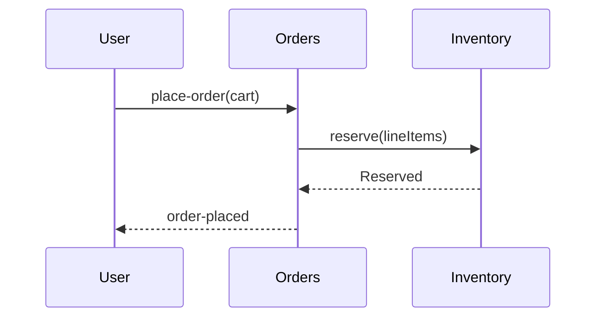

# Order placement flow

How a [[orders/cart]] becomes a confirmed [[orders/order]] through the [[orders/place-order]] service, and where the [[order-aggregate]] enforces consistency.

## Motivation

Checkout must be atomic: a [[orders/order-placed]] event fires only after stock is reserved and payment authorized. Today the steps are scattered; this spec pins the sequence.

## Flow

## Decisions

### Decision 1 — Reservation before payment

Reserve stock through the anticorruption seam first, then authorize payment. Rejected: payment-first (leaves money held against out-of-stock carts).

The reservation logic lives in `sample/orders/src/place_order.py::PlaceOrder`.

| Phase | Gate |
|---|---|
| Reserve | stock available |
| Authorize | funds held |
| Confirm | both succeed |
